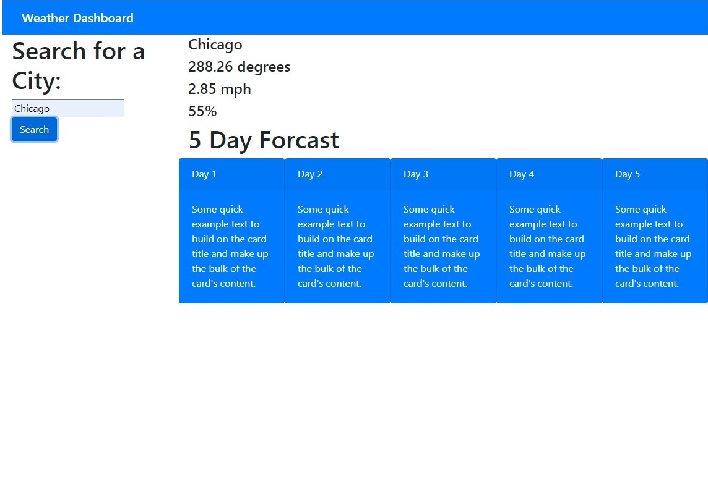

# 06-homework
Title: Weather Dashboard

This website has a searchfield for any city that runs weather api which shows you current weather for that city including current temp, humidity, wind, and UV index.  It also shows you a 5 day forcast that updates every 3 hours.

https://jsumis.github.io/06-homework/